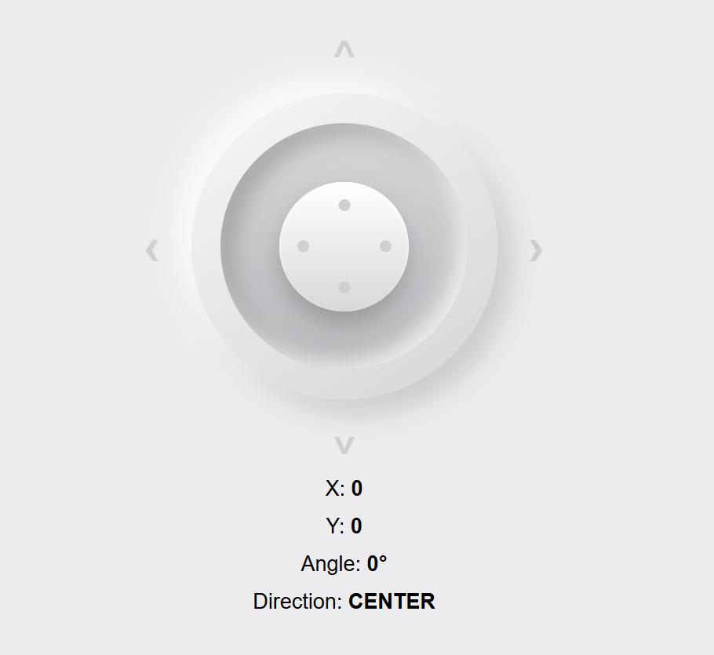

<h1>💻 有趣的前端 🔥</h1>
<h3>1.精选有趣的前端项目与代码片段，收录社区优秀开源作品。 
2.汇集各类好玩的前端Demo，部分原创，致敬社区大佬佳作。 
3.分享趣味前端实现，整合个人练习与网络优质开源资源</h3>

|              预览               | 下载                        |
| :-----------------------------: | --------------------------- |
|    | [下载](.resume/键帽.html)   |
|    | [下载](.resume/雪花.html)   |
|  | [下载](.resume/机器人.html) |
|  | [下载](.resume/摇杆.html) |

## **贡献与致谢 (Contributing & Credits)**

感谢所有开源社区的开发者们！如果你是某个项目的原作者，且希望署名或删除，请随时通过 Issue 联系我。

如果你也有好玩的前端项目想要分享，欢迎提交 PR！

------

## **许可证 (License)**
*注：收录的第三方开源项目版权归原作者所有，请遵循其各自的开源协议。*
